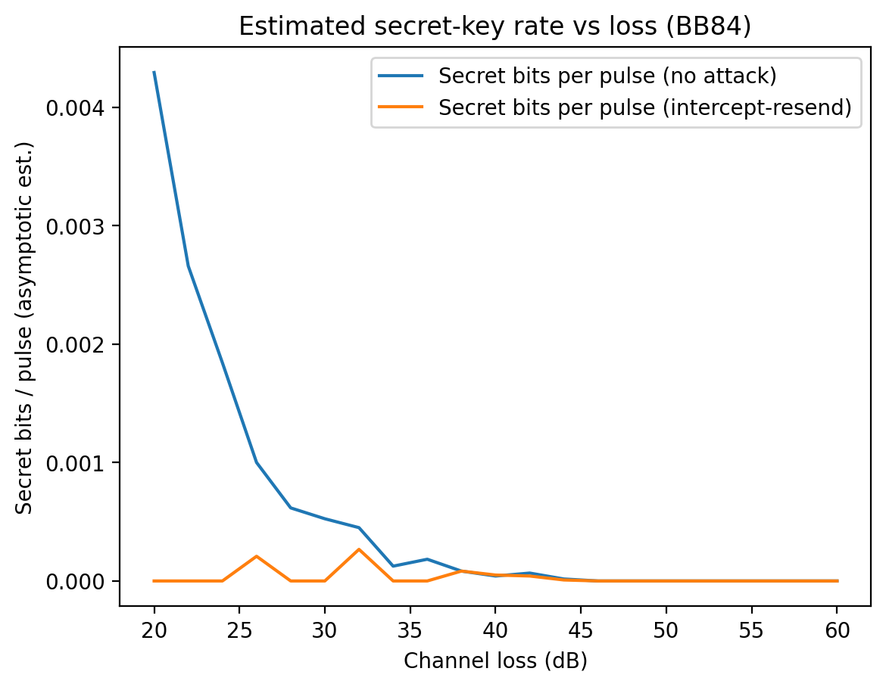
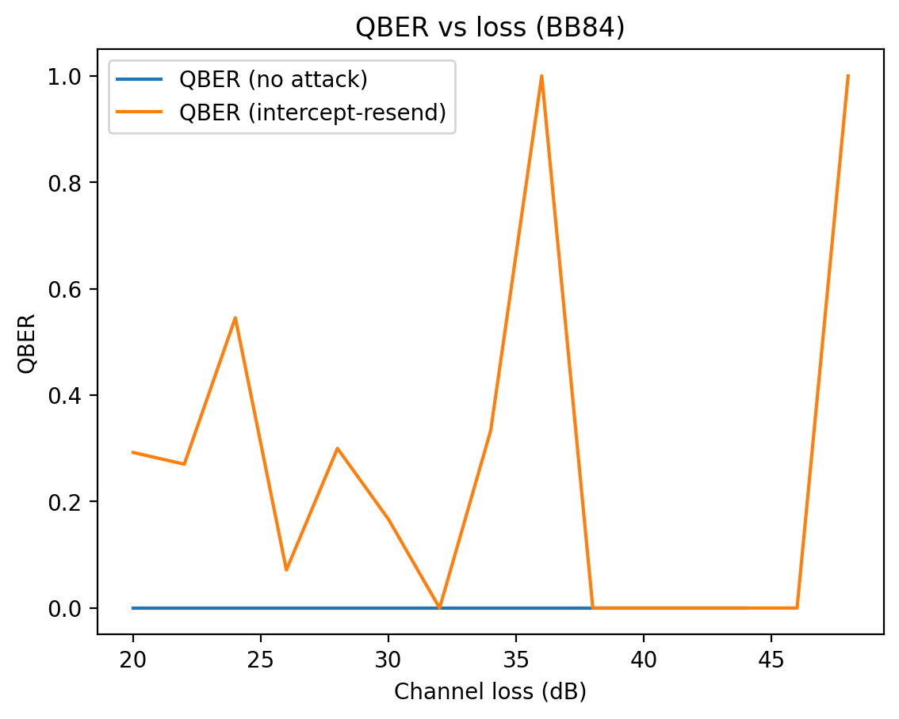

# Satellite Quantum Key Distribution Security Curves

*Quantum keys don’t fail quietly—loss and noise can leave you with bits, but no secrecy. We model the cliff to surface silent breakage before it becomes a system risk.*

<br>

[](https://www.python.org/downloads/)
[](https://opensource.org/licenses/MIT)
[](https://scholar.google.com/citations?user=tvwpCcgAAAAJ)
[](https://huggingface.co/Cohaerence)
[](https://x.com/coherence)
[](https://www.christopheraltman.com)
[](https://www.linkedin.com/in/Altman)

## Problem / Phenomenon Investigated

Satellite and fibre Quantum Key Distribution (QKD) systems live or die on a simple fact: bits can still flow while secrecy collapses. This experiment creates a reproducible “security curve” lab: simulate BB84 under realistic loss/noise and a textbook intercept–resend attacker, then compute QBER and the asymptotic secret-key fraction.

## Hypothesis or Construct

If we model (i) channel loss in dB, (ii) intrinsic measurement noise, and (iii) a simple active attack, we should see a sharp operational threshold: QBER rises past a regime where privacy amplification can no longer extract a secret key, even if classical throughput remains nonzero.

## Method

- Where signal comes from: Monte Carlo simulation of BB84 prepare-and-measure, basis sifting, parameter estimation, and secret-fraction calculation.
- Why this architecture/data was chosen: BB84 is the canonical QKD protocol; intercept–resend is the simplest attack with a visible QBER signature; dB loss is the lingua franca of link budgets (fibre and free-space).
- What is being experimentally compared:
        - no attack vs intercept–resend
        - sweeps over loss_db and intrinsic flip_prob
        - optional “satellite pass” mapping elevation angle → loss_db

## Implementation

- Python package under /src/sat_qkd_lab
- CLI:
        - python -m sat_qkd_lab.run sweep --help
- Requirements: pyproject.toml (numpy, matplotlib)

## Results

The model generates:

- figures/key_rate_vs_loss.png
- figures/qber_vs_loss.png
- reports/latest.json (raw sweep metrics)

### Figure 1: Secret-key rate vs loss (BB84



**Figure 1. Estimated secret-key rate versus channel loss for BB84.**  
A Monte-Carlo sweep shows that link loss alone reduces detections but does not destroy secrecy until error rates dominate. Under an intercept–resend attack, the secret-key fraction collapses to zero at moderate loss even while sifted bits remain non-zero, revealing the security cliff where privacy amplification can no longer extract secrecy.

### Figure 2: QBER vs loss (BB84)



**Figure 2. Quantum Bit Error Rate (QBER) versus channel loss for BB84.**  
Without attack, intrinsic measurement noise keeps QBER low across loss. An intercept–resend adversary injects a strong QBER signature, driving errors beyond the tolerable entropy budget. The plotted spikes illustrate the detectable breakage regime that classical throughput monitors would miss without explicit QBER estimation.

## Interpretation

The curves show an engineering-facing “security budget.” Loss reduces detections (sifted key), while noise and attacks raise QBER. Once QBER rises enough, the secret fraction collapses to zero: you can still exchange bits, but you cannot distill secrecy. This makes the QKD security story measurable and testable, rather than rhetorical.

## Why this matters

Physics-level behavior (loss/noise/attack) translates into operational metrics (QBER, secret-key rate), imperative metrics in the construction of integrated satellite + fibre QKD networks.

## Topics

`qml` · `quantum-ml` · `verification` · `cryptography` · `robustness` · `quantum-cryptography` · `qkd` · `bb84` · `satellite` · `security` · `noise-analysis` · `infosec` · `network-security` · `simulation`

## References

1. Bennett, C. H., & Brassard, G. (1984). **Quantum cryptography: Public key distribution and coin tossing.** *Proceedings of the IEEE International Conference on Computers, Systems and Signal Processing* (Bangalore, India), 175–179.

2. Ekert, A. K. (1991). **Quantum cryptography based on Bell’s theorem.** *Physical Review Letters*, *67*(6), 661–663. https://doi.org/10.1103/PhysRevLett.67.661

3. Shor, P. W., & Preskill, J. (2000). **Simple proof of security of the BB84 quantum key distribution protocol.** *Physical Review Letters*, *85*, 441–444. https://doi.org/10.1103/PhysRevLett.85.441

4. Renner, R., Gisin, N., & Kraus, B. (2005). **An information-theoretic security proof for QKD protocols.** *Physical Review A*, *72*, 012332. https://doi.org/10.1103/PhysRevA.72.012332 *(Preprint: arXiv:quant-ph/0502064)*

5. Gisin, N., Ribordy, G., Tittel, W., & Zbinden, H. (2002). **Quantum cryptography.** *Reviews of Modern Physics*, *74*(1), 145–195. https://doi.org/10.1103/RevModPhys.74.145

6. Altman, C., Wiliams, C., Ursin, R., Villoresi, P., Sharma, V. **Astronaut Development and Deployment of a Secure Space Communications Network,** NASA NIAC/OCT; DARPA QUINESS (Macroscopic Quantum Communications). [PDF](https://drive.google.com/file/d/0B99KWApna6GoX3JzZGMzbzNrMjg/view?resourcekey=0-b1lf7VUq8QmpRriVN5N2sw)

## Citations

If you use QVL in your research, please cite:

```bibtex
@software{sat-qkd-curves2026,
  title={Satellite Quantum Key Distribution Security Curves},
  author={Altman, Christopher},
  year={2026},
  url={https://github.com/christopher-altman/sat-qkd-security-curves}
}
```

## License

MIT License. See [LICENSE](LICENSE) for details.

## Contact

- **Website:** [christopheraltman.com](https://christopheraltman.com)
- **Research portfolio:** [lab.christopheraltman.com](https://lab.christopheraltman.com/)
- **Portfolio mirror:** [christopher-altman.github.io](https://christopher-altman.github.io/)
- **GitHub:** [github.com/christopher-altman](https://github.com/christopher-altman)
- **Google Scholar:** [scholar.google.com/citations?user=tvwpCcgAAAAJ](https://scholar.google.com/citations?user=tvwpCcgAAAAJ)
- **Email:** x@christopheraltman.com

---

*Christopher Altman (2026)*
