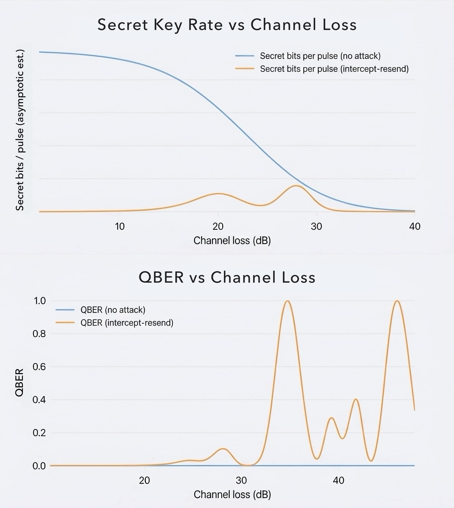

# Satellite Quantum Key Distribution Security Curves

*Quantum keys don’t fail quietly—loss and noise can leave you with bits, but no secrecy. We model the cliff to surface silent breakage before it becomes a system risk.*

[](https://www.python.org/downloads/)
[](https://opensource.org/licenses/MIT)
[](https://scholar.google.com/citations?user=tvwpCcgAAAAJ)
[](https://huggingface.co/Cohaerence)
[](https://x.com/coherence)
[](https://www.christopheraltman.com)
[](https://www.linkedin.com/in/Altman)

<a id="featured-figure"></a>
<picture>
  <source media="(prefers-color-scheme: dark)" srcset="figures/hero_dark.jpg">
  
</picture>

*Featured result: secret-key rate and QBER vs channel loss (no-attack vs intercept–resend).*
Plots are generated by `./py -m sat_qkd_lab.run sweep` and written to `figures/`.

## Mathematical spine

Transmittance `η` is the probability a photon survives the channel and reaches the receiver.  
QBER `e` is the bit error rate after sifting, so it captures the net disturbance of the link.  
Binary entropy `h(e)` expresses uncertainty per bit (0 to 1), and it rises quickly with noise.  
For BB84, the asymptotic secret fraction decreases as `e` grows and vanishes as `e → 0.5`.  
That’s the security cliff: detections and sifted bits can remain nonzero while secrecy collapses.  

## Physical model intuition

Abort headroom is `qber_abort − qber_mean`, the distance to the protocol’s error threshold.  
CAR (coincidence‑to‑accidental ratio) is a signal‑quality witness in entanglement‑based QKD.  
Link loss in dB maps to transmittance via `loss_db = −10 log10(η)`.  
Satellite passes turn elevation into time‑varying loss and background noise.  
Finite‑key bounds cap what can be claimed with limited samples, even when averages look good.  

This lab acts as a link‑budget → security‑budget translator for engineering decisions.  

## Quickstart

```bash
git clone https://github.com/christopher-altman/sat-qkd-security-curves
cd sat-qkd-security-curves

# ensure repo-local runners are executable (if present)
[ -f ./py ] && chmod +x ./py
[ -f ./pytest ] && chmod +x ./pytest

# fail fast if runners are missing
test -x ./py || { echo "Missing ./py runner; see repo-local runners section." >&2; exit 1; }
test -x ./pytest || { echo "Missing ./pytest runner; see repo-local runners section." >&2; exit 1; }

PY=python3
$PY -V  # must be >= 3.10
test -x .venv/bin/python || $PY -m venv .venv

./py -m pip install -U pip
./py -m pip install -e ".[dev]"

./py -m sat_qkd_lab.run --help
./pytest -q
```

## Repository layout

```
.
├─ src/sat_qkd_lab/
│  ├─ run.py
│  ├─ plotting.py
│  ├─ attacks.py
│  ├─ pass_model.py
│  ├─ experiment.py
│  ├─ forecast.py
│  ├─ windows.py
│  ├─ scoring.py
│  ├─ eb_qkd.py
│  └─ finite_key.py
├─ tests/
│  ├─ test_forecast_harness.py
│  ├─ test_eb_pass_experiment.py
│  ├─ test_pass_sweep_pulse_accounting.py
│  └─ test_basic.py
├─ figures/
│  ├─ key_rate_vs_elevation.png
│  ├─ secure_window.png
│  └─ qber_headroom_vs_loss.png
├─ reports/
│  ├─ latest_pass.json
│  ├─ latest_experiment.json
│  └─ forecast_blinded.json
└─ docs/
   ├─ report-P9-ROB_EXPERIMENT_HARNESS.md
   ├─ diff-P9-ROB_EXPERIMENT_HARNESS.md
   ├─ report-P10-MPI_FORECAST_HARNESS.md
   └─ diff-P10-MPI_FORECAST_HARNESS.md
```

## Command map

```bash
./py -m sat_qkd_lab.run sweep --loss-min 20 --loss-max 60 --steps 21 --pulses 200000
./py -m sat_qkd_lab.run pass-sweep --max-elevation 70 --pass-duration 300
./py -m sat_qkd_lab.run experiment-run --n-blocks 20 --block-seconds 30 --outdir .
./py -m sat_qkd_lab.run forecast-run --forecasts forecasts.json --outdir .
```

## Artifacts & provenance

Each prompt writes `docs/report-P{N}-...` and `docs/diff-P{N}-...`. Reports include a verbatim `ls -l docs` gating proof for traceability.

## Problem / Phenomenon Investigated

Satellite and fibre Quantum Key Distribution (QKD) systems live or die on a simple fact: bits can still flow while secrecy collapses. This experiment creates a reproducible “security curve” lab: simulate BB84 under realistic loss/noise and a textbook intercept–resend attacker, then compute QBER and the asymptotic secret-key fraction.

## Hypothesis or Construct

If we model (i) channel loss in dB, (ii) intrinsic measurement noise, and (iii) a simple active attack, we should see a sharp operational threshold: QBER rises past a regime where privacy amplification can no longer extract a secret key, even if classical throughput remains nonzero.

## Method

- Where signal comes from: Monte Carlo simulation of BB84 prepare-and-measure, basis sifting, parameter estimation, and secret-fraction calculation.
- Why this architecture/data was chosen: BB84 is the canonical QKD protocol; intercept–resend is the simplest attack with a visible QBER signature; dB loss is the lingua franca of link budgets (fibre and free-space).
- What is being experimentally compared:
  - no attack vs intercept–resend
  - sweeps over loss_db and intrinsic flip_prob
  - optional “satellite pass” mapping elevation angle → loss_db

## Implementation

- Python package under `/src/sat_qkd_lab`
- CLI: `./py -m sat_qkd_lab.run <command> --help`
- Requirements: `pyproject.toml` (numpy, matplotlib)

### Features

**Detector/Background Model** — The simulation includes a realistic detector model with:
- `eta`: Detection efficiency (default 0.2)
- `p_bg`: Background/dark click probability per pulse (default 1e-4)

At high channel loss, background clicks dominate over signal clicks, causing QBER to approach 0.5. This models the operationally critical effect where the signal-to-noise ratio degrades.

**Monte Carlo Confidence Intervals** — Run multiple trials per loss value to obtain uncertainty estimates:
- `--trials N`: Number of independent trials (enables CI when N > 1)
- `--workers N`: Parallel workers for faster execution
- `--seed N`: Base random seed for reproducibility

Outputs include mean, standard deviation, and 95% CI bounds for QBER, secret fraction, and key rate per pulse. CI bounds are clamped to physical ranges (e.g., QBER ≤ 0.5, key rate ≥ 0).

**Key Rate Per Pulse** — The simulation now outputs `key_rate_per_pulse`, which properly accounts for the BB84 sifting factor (~1/2). This gives the asymptotic key rate normalized to sent pulses:
```
key_rate_per_pulse = (n_sifted / n_sent) × secret_fraction
```

**Decoy-State BB84** — The `decoy-sweep` command implements vacuum + weak decoy protocol:
- Uses three intensities (signal, decoy, vacuum) to bound single-photon contributions
- Computes asymptotic key rate using standard decoy-state bounds
- Demonstrates PNS attack resilience (motivation for real satellite QKD)

**Attack Surfaces (Toy Models)** — The `sweep` and `attack-sweep` commands can compare
educational attack models beyond intercept-resend:
- `pns`: Photon-number-splitting (reduces secrecy without adding QBER)
- `time_shift`: Exploits basis-dependent efficiency mismatch
- `blinding`: Forces clicks with loud/stealth modes

Example comparison sweep:
```bash
./py -m sat_qkd_lab.run attack-sweep --attacks none intercept_resend pns \
  --loss-min 20 --loss-max 55 --steps 8 --pulses 50000 --outdir .
```
This writes `figures/attack_comparison_key_rate.png`.

**Link Budget** — The `link_budget.py` module is an **Option A scenario generator** that maps elevation angles to loss values for demonstration. It is *not* a physically accurate optical link model. See `optical_link.py` for documentation of what a proper Option B model would require.

**Input Validation** — CLI arguments are validated post-parse with clear error messages:
- `validate_int(name, value, min_value, max_value)` — Integer bounds checking
- `validate_float(name, value, min_value, max_value, allow_nan, allow_inf)` — Float bounds with NaN/inf control
- `validate_seed(seed)` — Ensures seed is None or non-negative integer

Invalid inputs raise `ValueError` with the parameter name and invalid value.

**Abort Handling** — When QBER exceeds the abort threshold (default 11%), the protocol aborts and:
- `secret_fraction` is set to 0.0 (no key extractable)
- `n_secret_est` is set to 0
- `key_rate_per_pulse` returns 0.0

This ensures aborted trials contribute zero to aggregated statistics.

**Finite-Key Analysis** — The `--finite-key` flag enables finite-size security analysis using Hoeffding-type concentration bounds. This computes conservative secret key length estimates that account for statistical uncertainty in parameter estimation and explicit ε-budgeting:

- `--eps-pe`: Parameter estimation failure probability (default 1e-10)
- `--eps-sec`: Secrecy failure probability (default 1e-10)
- `--eps-cor`: Correctness failure probability (default 1e-15)
- `--ec-efficiency`: Error correction efficiency factor (default 1.16)
- `--f-ec`: Alias for `--ec-efficiency`
- `--pe-frac`: Fraction of sifted bits used for parameter estimation (default 0.5)
- `--m-pe`: Explicit parameter estimation sample size (overrides `--pe-frac`)
- `--n-sent`: Total pulses sent (overrides `--pulses` when set)
- `--rep-rate` + `--pass-seconds`: Alternative pulse accounting, with `n_sent = rep_rate * pass_seconds`

The finite-key rate is always ≤ the asymptotic rate, with the penalty decreasing as block size increases. The analysis uses:
- Hoeffding bounds for QBER estimation uncertainty
- Explicit error-correction leakage and ε-penalty terms
- Total security parameter: `eps_total = eps_pe + eps_sec + eps_cor`

Finite-key math (toy-but-recognizable BB84 bound):

```
h2(q) = -q*log2(q) - (1-q)*log2(1-q), with q clamped into [1e-12, 1-1e-12]
delta = sqrt( ln(1/eps_pe) / (2*m_pe) )
qber_upper = min(0.5, q_hat + delta)

leak_ec_bits = f_ec * n_sifted * h2(qber_upper)
delta_eps_bits = 2*log2(2/eps_sec) + log2(2/eps_cor)
ell_bits = n_sifted * max(0, 1 - 2*h2(qber_upper)) - leak_ec_bits - delta_eps_bits
key_rate_per_pulse_finite = ell_bits / n_sent
```

References:
- Tomamichel et al., "Tight finite-key analysis for quantum cryptography" (Nature Comm. 2012)
- Lim et al., "Concise security bounds for practical decoy-state QKD" (PRA 2014)

**Free-Space Optical Link Model** — The `pass-sweep` command provides a physically-grounded free-space link budget for satellite-to-ground QKD:

- **Diffraction/Coupling Model**: Gaussian beam propagation with diffraction-limited divergence (`θ = 1.22λ/D`) and receiver aperture coupling efficiency
- **Pointing Error/Jitter**: Rayleigh-distributed angular error with configurable `--sigma-point` (default 2 µrad)
- **Atmospheric Extinction**: Kasten-Young airmass formula with zenith loss scaling by elevation
- **Turbulence/Scintillation**: Lognormal fading model (`--turbulence` flag, `--sigma-ln` parameter)
- **Day/Night Background**: `--day` flag increases background noise by `--day-bg-factor` (default 100×)

```bash
# Night-time pass simulation (default)
./py -m sat_qkd_lab.run pass-sweep --max-elevation 70 --pass-duration 300

# Day-time pass with turbulence
./py -m sat_qkd_lab.run pass-sweep --day --turbulence --sigma-ln 0.3

# Custom optical parameters
./py -m sat_qkd_lab.run pass-sweep --tx-diameter 0.15 --rx-diameter 0.5 --altitude 600e3
```

Outputs:
- `figures/key_rate_vs_elevation.png` — Key rate vs elevation angle over pass
- `figures/secure_window_per_pass.png` — Secure communication window timing
- `figures/secure_window.png` — Finite-key secure window timing (pass-sweep schema)
- `figures/loss_vs_elevation.png` — Total link loss vs elevation
- `reports/latest.json` — Pass sweep results with secure window summary
- `reports/latest_pass.json` — Pass sweep summary with finite-key bounds (schema v1.0)

References:
- Liao et al., "Satellite-to-ground quantum key distribution" (Nature 2017)
- Bourgoin et al., "Free-space QKD to a moving receiver" (NJP 2013)

**Entanglement-Based QKD (EB-QKD)** — The `sat_qkd_lab.eb_qkd` module adds a passive-basis EB-QKD expected-value harness with finite-key bounds using Hoeffding concentration. It reports `qber_upper`, `secret_fraction_finite`, and abort logic for conservative privacy amplification estimates.

**Blinded Intervention Harness** — The `experiment-run` command generates a randomized A/B schedule with deterministic seeding and stores blinded schedules separately from optional unblinded labels. By default, the analysis block is blinded (group labels omitted) to support experimental hygiene without interpretive claims.

**Forecast Harness** — The `forecast-run` command ingests external forecasts, scores them against deterministic window outcomes, and writes blinded reports by default. Forecast scoring compares predicted thresholds or directional claims to measured metrics.

```bash
# Blinded forecast scoring
./py -m sat_qkd_lab.run forecast-run --forecasts forecasts.json --outdir .

# Unblinded scoring with group labels
./py -m sat_qkd_lab.run forecast-run --forecasts forecasts.json --outdir . --unblind
```

### Simulator API

The core simulation functions are:
- `sat_qkd_lab.bb84.simulate_bb84()` — Single-photon BB84 Monte Carlo simulation
- `sat_qkd_lab.decoy_bb84.simulate_decoy_bb84()` — Decoy-state BB84 with vacuum + weak decoy
- `sat_qkd_lab.free_space_link.total_link_loss_db()` — Free-space link loss from elevation angle
- `sat_qkd_lab.sweep.sweep_pass()` — Satellite pass simulation with free-space link model

Both return structured results with QBER, secret fraction, and key rate metrics.

### Example Commands

```bash
# Single-trial BB84 sweep (fast)
./py -m sat_qkd_lab.run sweep --loss-min 20 --loss-max 60 --steps 21

# BB84 sweep with detector model and CI (10 trials per point)
./py -m sat_qkd_lab.run sweep --trials 10 --eta 0.2 --p-bg 1e-4

# Decoy-state BB84 sweep
./py -m sat_qkd_lab.run decoy-sweep --loss-min 20 --loss-max 50 --steps 16

# Decoy realism: intensity noise + afterpulsing + dead time + eta mismatch
./py -m sat_qkd_lab.run decoy-sweep --loss-min 20 --loss-max 50 --steps 16 \
  --mu-sigma 0.02 --decoy-mu-sigma 0.01 \
  --afterpulse-prob 0.02 --afterpulse-window 3 \
  --dead-time-pulses 5 --eta-z 0.22 --eta-x 0.18

# Finite-key analysis sweep
./py -m sat_qkd_lab.run sweep --finite-key --pulses 500000 --eps-pe 1e-10 --eps-sec 1e-10

# Finite-key rate vs total pulses (uses representative loss point)
./py -m sat_qkd_lab.run sweep --finite-key --rep-rate 1e7 --pass-seconds 30

# Free-space satellite pass sweep (night-time)
./py -m sat_qkd_lab.run pass-sweep --max-elevation 60 --pass-duration 300

# Free-space pass with turbulence and day-time background
./py -m sat_qkd_lab.run pass-sweep --day --turbulence --sigma-ln 0.3
```

### Engineering Outputs

The simulator provides hardware-relevant metrics for system planning:

**Bits per second and total bits per pass:**
```bash
# Compute key rate in bps and total secret bits for a 300s pass at 100 MHz rep rate
./py -m sat_qkd_lab.run sweep --loss-min 20 --loss-max 50 --steps 16 \
  --rep-rate-hz 1e8 --pass-seconds 300
```
This adds `key_rate_bps` and `total_secret_bits` fields to the JSON output.

**Required repetition rate to hit a target key volume:**
```bash
# Compute required rep rate to generate 1 million secret bits in a 300s pass
./py -m sat_qkd_lab.run sweep --loss-min 20 --loss-max 50 --steps 16 \
  --target-bits 1000000 --pass-seconds 300
```
This adds `required_rep_rate_hz` to the JSON output. If `key_rate_per_pulse <= 0`, the output is `"inf"` with a note explaining the condition cannot be met.

**Security headroom (QBER margin to abort threshold):**

All sweeps now include `headroom` fields in the JSON output and generate `figures/qber_headroom_vs_loss.png`. Headroom is defined as:
- `headroom = qber_abort - qber_mean`

For multi-trial sweeps with confidence intervals:
- `headroom_ci_low = qber_abort - qber_ci_high` (conservative)
- `headroom_ci_high = qber_abort - qber_ci_low` (optimistic)

Units are absolute QBER (e.g., headroom = 0.05 means 5% margin to the 11% abort threshold).

## Results

The model generates:

- `figures/key_qber_vs_loss.png` — QBER vs channel loss
- `figures/key_fraction_vs_loss.png` — Secret fraction vs channel loss (legacy alias: `key_key_fraction_vs_loss.png`)
- `figures/qber_vs_loss_ci.png` — QBER with 95% CI bands (when `--trials > 1`)
- `figures/secret_fraction_vs_loss_ci.png` — Secret fraction with 95% CI (legacy alias: `key_rate_vs_loss_ci.png`)
- `figures/qber_headroom_vs_loss.png` — Security headroom (QBER margin to abort) vs loss
- `figures/decoy_key_rate_vs_loss.png` — Decoy-state key rate vs loss
- `figures/decoy_key_rate_vs_loss_realism.png` — Decoy key rate vs loss with realism enabled
- `figures/finite_key_comparison.png` — Asymptotic vs finite-key rate (when `--finite-key`)
- `figures/finite_key_bits_vs_loss.png` — Extractable secret bits vs loss (when `--finite-key`)
- `figures/finite_size_penalty.png` — Finite-size penalty factor vs loss (when `--finite-key`)
- `figures/finite_key_rate_vs_n_sent.png` — Finite-key rate vs total pulses (when `--finite-key`)
- `figures/key_rate_vs_elevation.png` — Key rate vs elevation angle (when `pass-sweep`)
- `figures/secure_window_per_pass.png` — Secure window timing over pass (when `pass-sweep`)
- `figures/loss_vs_elevation.png` — Total link loss vs elevation (when `pass-sweep`)
- `reports/latest.json` — Raw sweep metrics with schema version and timestamp

**Figure 1. Estimated secret-key rate versus channel loss for BB84.** ([↑ featured figure](#featured-figure))  
A Monte-Carlo sweep shows that link loss alone reduces detections but does not destroy secrecy until error rates dominate. Under an intercept–resend attack, the secret-key fraction collapses to zero at moderate loss even while sifted bits remain non-zero, revealing the security cliff where privacy amplification can no longer extract secrecy.

**Figure 2. Quantum Bit Error Rate (QBER) versus channel loss for BB84.** ([↑ featured figure](#featured-figure))  
Without attack, intrinsic measurement noise keeps QBER low across loss. An intercept–resend adversary injects a strong QBER signature, driving errors beyond the tolerable entropy budget. The plotted spikes illustrate the detectable breakage regime that classical throughput monitors would miss without explicit QBER estimation.

### JSON Output Schema (v0.3)

The output JSON includes these fields for CI sweeps:

```json
{
  "schema_version": "0.4",
  "generated_utc": "2026-01-02T00:00:00Z",
  "loss_sweep_ci": {
    "no_attack": [{
      "qber_mean": 0.025,
      "qber_ci_low": 0.018,
      "qber_ci_high": 0.032,
      "secret_fraction_mean": 0.85,
      "secret_fraction_ci_low": 0.80,
      "secret_fraction_ci_high": 0.90,
      "key_rate_per_pulse_mean": 0.0012,
      "key_rate_per_pulse_ci_low": 0.0010,
      "key_rate_per_pulse_ci_high": 0.0014,
      "abort_rate": 0.0
    }]
  }
}
```

For finite-key sweeps (`--finite-key`), the JSON includes additional fields:

```json
{
  "schema_version": "0.4",
  "finite_key_sweep": {
    "no_attack": [{
      "loss_db": 25.0,
      "qber": 0.025,
      "qber_hat": 0.025,
      "qber_upper": 0.032,
      "ell_bits": 45000.0,
      "key_rate_per_pulse_asymptotic": 0.0012,
      "key_rate_per_pulse_finite": 0.0009,
      "finite_size_penalty": 0.25,
      "eps_total": 2.00001e-10,
      "f_ec": 1.16,
      "delta_eps_bits": 150.0
    }]
  },
  "parameters": {
    "finite_key": true,
    "eps_pe": 1e-10,
    "eps_sec": 1e-10,
    "eps_cor": 1e-15,
    "ec_efficiency": 1.16,
    "pe_frac": 0.5,
    "m_pe": null
  }
}
```

All CI lower bounds are clamped to 0; QBER CI upper is clamped to 0.5.


## Interpretation

The curves show an engineering-facing “security budget.” Loss reduces detections (sifted key), while noise and attacks raise QBER. Once QBER rises enough, the secret fraction collapses to zero: you can still exchange bits, but you cannot distill secrecy. This makes the QKD security story measurable and testable, rather than rhetorical.

## Why this matters

Physics-level behavior (loss/noise/attack) translates into operational metrics (QBER, secret-key rate), imperative metrics in the construction of integrated satellite + fibre QKD networks.

## Topics

`qml` · `quantum-ml` · `verification` · `cryptography` · `robustness` · `quantum-cryptography` · `qkd` · `bb84` · `satellite` · `security` · `noise-analysis` · `infosec` · `network-security` · `simulation`

## References

1. Bennett, C. H., & Brassard, G. (1984). [Quantum cryptography: Public key distribution and coin tossing.](https://www.sciencedirect.com/science/article/pii/S0304397514004241) *Proceedings of the IEEE International Conference on Computers, Systems and Signal Processing* (Bangalore, India), 175–179.

2. Ekert, A. K. (1991). [Quantum cryptography based on Bell’s theorem.](https://doi.org/10.1103/PhysRevLett.67.661) *Physical Review Letters*, *67*(6), 661–663. 

3. Shor, P. W., & Preskill, J. (2000). [Simple proof of security of the BB84 quantum key distribution protocol.](https://doi.org/10.1103/PhysRevLett.85.441) *Physical Review Letters*, *85*, 441–444. 

4. Renner, R., Gisin, N., & Kraus, B. (2005). [An information-theoretic security proof for QKD protocols.](http://arXiv:quant-ph/0502064) *[Physical Review A](https://doi.org/10.1103/PhysRevA.72.012332)*, *72*, 012332.  

5. Gisin, N., Ribordy, G., Tittel, W., & Zbinden, H. (2002). [Quantum cryptography.](https://doi.org/10.1103/RevModPhys.74.145) *Reviews of Modern Physics*, *74*(1), 145–195. 

6. Altman, C., Williams, C., Ursin, R., Villoresi, P., Sharma, V. [Astronaut Development and Deployment of a Secure Space Communications Network.](https://drive.google.com/file/d/0B99KWApna6GoX3JzZGMzbzNrMjg/view?resourcekey=0-b1lf7VUq8QmpRriVN5N2sw) NASA NIAC/OCT; DARPA QUINESS (Macroscopic Quantum Communications). 

## Citations

If you use QVL in your research, please cite:

```bibtex
@software{sat-qkd-curves2026,
  title={Satellite Quantum Key Distribution Security Curves},
  author={Altman, Christopher},
  year={2026},
  url={https://github.com/christopher-altman/sat-qkd-security-curves}
}
```

## License

MIT License. See [LICENSE](LICENSE) for details.

## Contact

- **Website:** [christopheraltman.com](https://christopheraltman.com)
- **Research portfolio:** [lab.christopheraltman.com](https://lab.christopheraltman.com/)
- **Portfolio mirror:** [christopher-altman.github.io](https://christopher-altman.github.io/)
- **GitHub:** [github.com/christopher-altman](https://github.com/christopher-altman)
- **Google Scholar:** [scholar.google.com/citations?user=tvwpCcgAAAAJ](https://scholar.google.com/citations?user=tvwpCcgAAAAJ)
- **Email:** x@christopheraltman.com

---

*Christopher Altman (2026)*
