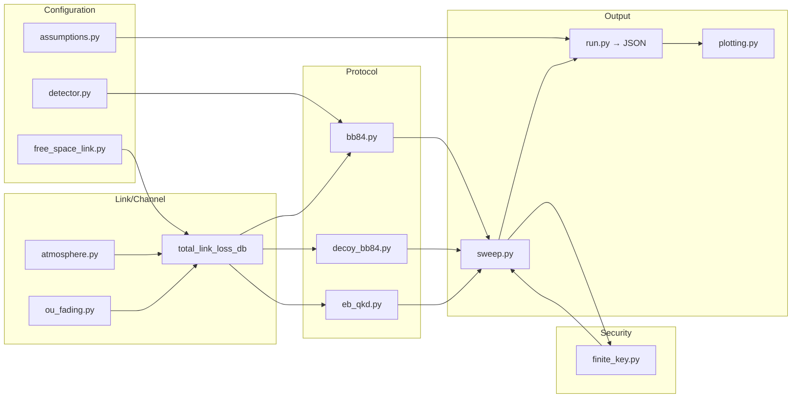

# Satellite Quantum Key Distribution Security Curves

*Quantum keys can fail quietly—loss and noise can leave you with bits, but no secrecy. We model the cliff to expose silent breakage before it becomes a system risk.*

[](https://www.python.org/downloads/)
[](https://github.com/christopher-altman/sat-qkd-security-curves/actions/workflows/ci.yml)
[](https://opensource.org/licenses/MIT)
[](https://scholar.google.com/citations?user=tvwpCcgAAAAJ)
[](https://huggingface.co/Cohaerence)
[](https://x.com/coherence)
[](https://www.christopheraltman.com)
[](https://www.linkedin.com/in/Altman)

<br>

> **Abstract.** In satellite QKD operations, the key failure mode is “bits without secrecy.” We propose and validate a telemetry-to-secrecy pipeline that maps pass-time observables and forecast proxies, together with link dynamics, to finite-key secret-key-rate lower bounds (with explicit ε-budget allocation), yielding actionable go/no-go and sensitivity surfaces.

<br>

<a id="featured-figure"></a>


*Featured result (post-pass): Secret-key rate and QBER vs channel loss; finite-key variants quantify confidence/ε-budget penalties.*
Run `./py -m sat_qkd_lab.run sweep` to produce plots in `figures/`.

<br>

This framework supports **pass-time quality telemetry and post-pass security distillation** under delayed-classical CONOPS (qubits downlinked during pass; reconciliation later over RF). During the pass, use `pass-sweep` and `forecast-run` to estimate viability from observables available in the downlink; compute QBER post-pass via `replay` and the experiment harness inputs.

<br>

## Table of Contents

- [Quickstart](#quickstart)
- [Operator Workflows](#operator-workflows)
  - [Link Engineering](#link-engineering)
  - [Cryptography & Security](#cryptography--security)
  - [Hardware & Detectors](#hardware--detectors)
  - [Operations](#operations)
- [CLI Examples](#cli-examples)
  - [Glossary (operational definitions)](#glossary)
- [Layout](#layout)
- [Problem](#problem)
- [Core Claim](#core-claim)
- [Physics/Math Background](#physicsmath-background)
- [Method](#method)
- [Approach](#approach)
- [Implementation](#implementation)
  - [Features](#features)
  - [Simulator API](#simulator-api)
  - [Example Commands](#example-commands)
- [Capabilities](#capabilities)
- [Results](#results)
- [Verification / Golden checks](#verification--golden-checks)
  - [JSON Output Schema (v0.4)](#json-output-schema-v04)
- [Interpretation](#interpretation)
- [Why it matters](#why-it-matters)
- [Architecture](#architecture)
  - [High-Level Pipeline](#high-level-pipeline)
  - [Override Safety (Simulator)](#override-safety)
- [Physical Assumptions (Link Model Card)](#physical-assumptions-link-model-card)
  - [Key Link Parameters](#key-link-parameters)
  - [Model Characteristics](#model-characteristics)
  - [Override Safety (Link Model)](#override-safety-link-model)
- [Topics](#topics)
- [References](#references)
- [Citations](#citations)
- [License](#license)
- [Contact](#contact)

## Quickstart

Repo-local runners are `./py` and `./pytest`. If present, make them executable and verify they exist before proceeding (fail fast if they are missing).

```bash
git clone https://github.com/christopher-altman/sat-qkd-security-curves
cd sat-qkd-security-curves

[ -f ./py ] && chmod +x ./py
[ -f ./pytest ] && chmod +x ./pytest

test -x ./py || { echo "Missing ./py runner; see repo-local runners section." >&2; exit 1; }
test -x ./pytest || { echo "Missing ./pytest runner; see repo-local runners section." >&2; exit 1; }

PY=python3
$PY -V  # must be >= 3.10
test -x .venv/bin/python || $PY -m venv .venv

./py -m pip install -U pip
./py -m pip install -e ".[dev]"

./py -m sat_qkd_lab.run --help
./pytest -q
```

## Operator Workflows

**Purpose:** Role-based workflows with reproducible commands, expected outputs, and explicit pass/fail gates.

### Link Engineering

**Goal:** Sanity-check link sensitivity (loss, pointing, turbulence/fading) and spot the security cliff.

#### Workflow 1: Loss sweep to reproduce headline curves

```bash
./py -m sat_qkd_lab.run sweep --loss-min 20 --loss-max 60 --steps 21 --pulses 200000
```

**Outputs:**
- `figures/key_qber_vs_loss.png` — QBER vs channel loss
- `figures/key_fraction_vs_loss.png` — Secret fraction vs loss
- `reports/latest.json` — Full sweep metrics

**What to look for:**
- Monotonic QBER increase with loss (background/dark clicks dominating at high loss)
- Secret fraction cliff where QBER crosses abort threshold (~11%)
- Key rate per pulse approaching zero at the security boundary

#### Workflow 2: Satellite pass with turbulence/scintillation

```bash
./py -m sat_qkd_lab.run pass-sweep --max-elevation 70 --pass-duration 300 --turbulence --sigma-ln 0.3
```

**Outputs:**
- `figures/key_rate_vs_elevation.png` — Key rate over pass elevation profile
- `figures/loss_vs_elevation.png` — Link loss budget vs elevation
- `figures/secure_window_per_pass.png` — Secure window timing
- `reports/latest_pass.json` — Pass time-series and summary

**What to look for:**
- Elevation-dependent loss (airmass scaling)
- Turbulence-induced QBER variance (fading effects)
- Secure window fragmentation (outage events)

#### Workflow 3: Day vs night background sensitivity

```bash
# Night-time baseline
./py -m sat_qkd_lab.run pass-sweep --max-elevation 70 --pass-duration 300

# Day-time (100x background increase)
./py -m sat_qkd_lab.run pass-sweep --max-elevation 70 --pass-duration 300 --day --day-bg-factor 100
```

**Outputs:**
- Same as Workflow 2 (figures + `reports/latest_pass.json`)

**What to look for:**
- Background-induced QBER floor in daytime scenario
- Reduction in secure window duration and total secret bits
- Shift in viability threshold (minimum usable elevation angle)

---

### Cryptography & Security

**Goal:** Show how finite-key penalties and security parameters change viability.

#### Workflow 1: Baseline BB84 sweep (asymptotic)

```bash
./py -m sat_qkd_lab.run sweep --loss-min 20 --loss-max 60 --steps 21 --pulses 200000
```

**Outputs:**
- `figures/key_qber_vs_loss.png`
- `figures/key_fraction_vs_loss.png`
- `reports/latest.json`

**What to look for:**
- Asymptotic secret fraction (≈ 1 − 2·h(QBER) for BB84)
- Abort threshold crossing (QBER > ~11%)
- Key rate per pulse scaling with sifted fraction

#### Workflow 2: Finite-key analysis with epsilon budget

```bash
./py -m sat_qkd_lab.run sweep --loss-min 20 --loss-max 60 --steps 21 --pulses 500000 --finite-key --eps-pe 1e-10 --eps-sec 1e-10 --eps-cor 1e-15
```

**Outputs:**
- `figures/finite_key_comparison.png` — Asymptotic vs finite-key rates
- `figures/finite_size_penalty.png` — Penalty factor vs loss
- `figures/finite_key_bits_vs_loss.png` — Extractable secret bits
- `reports/latest.json` (includes `finite_key_sweep` fields)

**What to look for:**
- Finite-key penalty (gap between asymptotic and finite-key rates)
- Penalty scaling with block size (larger blocks → smaller penalty)
- Security boundary shift (finite-key rate hits zero earlier than asymptotic)
- Epsilon budget allocation (eps_pe + eps_sec + eps_cor = eps_total)

#### Workflow 3: Attack comparison sweep

```bash
./py -m sat_qkd_lab.run attack-sweep --loss-min 20 --loss-max 50 --steps 9 --pulses 50000
```

**Outputs:**
- `figures/attack_comparison_key_rate.png` — Key rates under different attack models
- `reports/latest.json` (includes `attack_sweep` results)

**What to look for:**
- Intercept-resend signature (QBER spike, key rate collapse)
- PNS impact on multi-photon pulses
- Attack detectability via QBER monitoring (deviation from expected noise floor)

---

### Hardware & Detectors

**Goal:** Show detector/dark/background sensitivity and its effect on QBER and viability.

#### Workflow 1: Detector efficiency sensitivity

```bash
# High efficiency (eta = 0.4)
./py -m sat_qkd_lab.run sweep --loss-min 20 --loss-max 60 --steps 21 --pulses 200000 --eta 0.4

# Low efficiency (eta = 0.1)
./py -m sat_qkd_lab.run sweep --loss-min 20 --loss-max 60 --steps 21 --pulses 200000 --eta 0.1
```

**Outputs:**
- `figures/key_qber_vs_loss.png`
- `figures/key_fraction_vs_loss.png`
- `reports/latest.json`

**What to look for:**
- Lower eta → fewer sifted bits at the same loss
- Lower eta → background-dominated regime at lower loss values
- Detection rate vs QBER tradeoff

#### Workflow 2: Background/dark count sensitivity

```bash
# Low background (p_bg = 1e-6)
./py -m sat_qkd_lab.run sweep --loss-min 20 --loss-max 60 --steps 21 --pulses 200000 --p-bg 1e-6

# High background (p_bg = 1e-3)
./py -m sat_qkd_lab.run sweep --loss-min 20 --loss-max 60 --steps 21 --pulses 200000 --p-bg 1e-3
```

**Outputs:**
- `figures/key_qber_vs_loss.png`
- `figures/qber_headroom_vs_loss.png`
- `reports/latest.json`

**What to look for:**
- High p_bg → QBER floor even at low loss
- Background-limited secure distance (maximum tolerable loss)
- Headroom reduction (distance to abort threshold)

#### Workflow 3: Decoy-state BB84 analysis

```bash
./py -m sat_qkd_lab.run decoy-sweep --loss-min 20 --loss-max 50 --steps 16 --pulses 200000
```

**Outputs:**
- `figures/decoy_key_rate_vs_loss.png` — Decoy-state key rate
- `reports/latest.json` (includes `decoy_sweep` results)

**What to look for:**
- Single-photon contribution bounds (vacuum + weak decoy protocol)
- PNS resilience (decoy vs standard BB84 comparison)
- Intensity modulation effects (signal vs decoy vs vacuum)

---

### Operations

**Goal:** Minimal cognitive load: run one command, read two numbers, decide go/no-go.

#### Workflow 1: Single-command pass analysis

```bash
./py -m sat_qkd_lab.run pass-sweep --max-elevation 70 --pass-duration 300
```

**Outputs:**
- `figures/key_rate_vs_elevation.png`
- `figures/secure_window_per_pass.png`
- `reports/latest_pass.json`

**What to look for:**
- Open `figures/key_rate_vs_elevation.png` and confirm positive key rate during the pass
- Open `reports/latest_pass.json` and read `summary.total_secret_bits` (example target: > 1e6 bits)
- Go/no-go: total_secret_bits > threshold AND QBER < ~11%

#### Workflow 2: Dashboard (interactive exploration)

```bash
# Install dashboard dependencies (one-time)
./py -m pip install -e ".[dashboard]"

# Launch dashboard
./py -m sat_qkd_lab.dashboard
```

**Access:** Open browser to `http://localhost:8501`

**What to look for:**
- Interactive controls for loss, detector params, finite-key settings
- Live plots update as parameters change
- Summary metrics panel (QBER, key rate, abort status)
- **Compare tab:** Select two `reports/assumptions.json` files to compute a structured diff (added/removed/changed parameters).
- **Export packets:** Create timestamped bundles of reports + plots + assumptions snapshots.

**Assumptions snapshot:** `reports/assumptions.json` is written alongside `reports/latest.json` so you can reproduce runs and diff parameter changes.

## CLI Examples

All commands accept `--help` to display available flags, defaults, and usage examples:

```bash
./py -m sat_qkd_lab.run sweep --help
./py -m sat_qkd_lab.run pass-sweep --help
```

Quick run examples:

```bash
# BB84 sweep (simulated)
./py -m sat_qkd_lab.run sweep --loss-min 20 --loss-max 60 --steps 21 --pulses 200000
# Assumptions manifest (single source of truth)
./py -m sat_qkd_lab.run assumptions
# Mission narrative (simulated)
./py -m sat_qkd_lab.run mission
# Replay a prior sweep report without drift
./py -m sat_qkd_lab.run replay --report reports/latest.json --outdir .
# Finite-key sweep (simulated)
./py -m sat_qkd_lab.run sweep --loss-min 20 --loss-max 60 --steps 21 --pulses 500000 --finite-key --eps-pe 1e-10 --eps-sec 1e-10 --eps-cor 1e-15
# Decoy-state sweep (simulated)
./py -m sat_qkd_lab.run decoy-sweep --loss-min 20 --loss-max 50 --steps 16 --pulses 200000
# Attack comparison sweep (simulated)
./py -m sat_qkd_lab.run attack-sweep --loss-min 20 --loss-max 50 --steps 9 --pulses 50000
# Pass sweep with atmosphere flags (simulated)
./py -m sat_qkd_lab.run pass-sweep --max-elevation 70 --pass-duration 300 --day --turbulence --sigma-ln 0.3
# Experiment harness (help for inputs)
./py -m sat_qkd_lab.run experiment-run --help
# Forecast harness (help for inputs)
./py -m sat_qkd_lab.run forecast-run --help
# Calibration fitting (help for inputs)
./py -m sat_qkd_lab.run calibration-fit --help
# Constellation scheduler (help for inputs)
./py -m sat_qkd_lab.run constellation-sweep --help
# Clock sync estimator (help for inputs)
./py -m sat_qkd_lab.run clock-sync --help
# Sync estimate helper (help for inputs)
./py -m sat_qkd_lab.run sync-estimate --help
# OU fading simulator (help for inputs)
./py -m sat_qkd_lab.run fading-ou --help
# Basis bias simulator (help for inputs)
./py -m sat_qkd_lab.run basis-bias --help
# Coincidence simulation (simulated)
./py -m sat_qkd_lab.run coincidence-sim --loss-min 20 --loss-max 60 --steps 9 --outdir .
```

### Glossary (operational definitions)

- **QBER (Quantum Bit Error Rate):** Fraction of mismatched bits after sifting (range: 0 to 0.5). High QBER → low secrecy. Abort threshold: typically 11% for BB84.
- **Secret fraction:** Fraction of sifted bits remaining after privacy amplification (range: 0 to 1). Zero means no extractable key.
- **Key rate per pulse:** Secret bits generated per sent pulse (units: bits/pulse). Accounts for sifting factor (~0.5 for BB84) and secret fraction.
- **Finite-key penalty:** Gap between asymptotic and finite-key rates due to statistical uncertainty (larger blocks → smaller penalty).
- **Abort threshold:** QBER level where privacy amplification can no longer extract secrecy (11% for BB84, protocol-dependent).
- **Headroom:** Distance to abort threshold (qber_abort - qber_mean). Positive headroom → margin for noise fluctuations.

## Layout

```
.
├── pyproject.toml
├── README.md
├── .github
│   └── workflows
│       └── ci.yml
├── src
│   ├── main.py
│   └── sat_qkd_lab
│       ├── __init__.py
│       ├── attacks.py
│       ├── background_process.py
│       ├── basis_bias.py
│       ├── bb84.py
│       ├── calibration_fit.py
│       ├── calibration.py
│       ├── change_points.py
│       ├── clock_sync.py
│       ├── coincidence.py
│       ├── constellation.py
│       ├── dashboard.py
│       ├── decoy_bb84.py
│       ├── detector.py
│       ├── eb_observables.py
│       ├── eb_qkd.py
│       ├── event_stream.py
│       ├── experiment.py
│       ├── fading_samples.py
│       ├── fim_identifiability.py
│       ├── finite_key.py
│       ├── forecast_harness.py
│       ├── forecast.py
│       ├── free_space_link.py
│       ├── helpers.py
│       ├── hil_adapters.py
│       ├── link_budget.py
│       ├── optical_link.py
│       ├── optics.py
│       ├── ou_fading.py
│       ├── pass_model.py
│       ├── plotting.py
│       ├── pointing.py
│       ├── polarization_drift.py
│       ├── run.py
│       ├── scoring.py
│       ├── sweep.py
│       ├── telemetry.py
│       ├── timetags.py
│       ├── timing.py
│       └── windows.py
└── tests
    ├── conftest.py
    ├── test_adversary_system_realism.py
    ├── test_attack_surfaces.py
    ├── test_background_process.py
    ├── test_basic.py
    ├── test_basis_bias.py
    ├── test_bb84_protocol.py
    ├── test_bell_visibility_matrix.py
    ├── test_calibration_fit.py
    ├── test_calibration_model_card.py
    ├── test_calibration_residual_diagnostics.py
    ├── test_calibration.py
    ├── test_change_points.py
    ├── test_clock_sync.py
    ├── test_constellation.py
    ├── test_dashboard_helpers.py
    ├── test_decoy_realism.py
    ├── test_detector_attacks.py
    ├── test_detector_effects.py
    ├── test_eb_observables.py
    ├── test_eb_pass_experiment.py
    ├── test_engineering_outputs.py
    ├── test_event_stream_pipeline.py
    ├── test_fading_model.py
    ├── test_fading_samples.py
    ├── test_golden_curves.py
    ├── test_fdr_correction.py
    ├── test_fim_identifiability.py
    ├── test_finite_key_composable.py
    ├── test_forecast_harness.py
    ├── test_helpers_validation.py
    ├── test_hil_adapters.py
    ├── test_json_contract_stability.py
    ├── test_link_coincidence.py
    ├── test_motion_polarization_rotation.py
    ├── test_optical_link_integration.py
    ├── test_optics.py
    ├── test_ou_fading.py
    ├── test_parameter_validation.py
    ├── test_pass_sweep_ou_fading.py
    ├── test_pass_sweep_pulse_accounting.py
    ├── test_plotting_headroom_and_sweep_engineering.py
    ├── test_plotting_scale_settings.py
    ├── test_pointing_dynamics.py
    ├── test_polarization_drift.py
    ├── test_property_based.py
    ├── test_security_analysis.py
    ├── test_sync_estimate_command.py
    ├── test_sync_leakage_firewall.py
    ├── test_timetag_coincidence.py
    ├── test_timing_sync_layer.py
    ├── test_timing_timetags.py
    └── test_windows_experiment.py
```

## Problem

Satellite and fibre QKD systems live or die on a simple fact: bits can still flow while secrecy collapses. This repo is a reproducible “security curve” lab that translates link conditions (loss, background, detector effects, timing, and attack models) into security viability—so quiet failure becomes visible as an engineering threshold.

Operationally, it supports delayed-classical CONOPS: during a satellite pass, only qubits may be downlinked; basis reconciliation and key distillation can occur later via RF. In that setting, pass-time outputs are quality/viability proxies and forecasts, while QBER and key metrics are computed post-pass once classical context is available.

## Core Claim

If we model loss, noise, and a simple active attack under instrument-realistic constraints, we see an operational security cliff: QBER crosses a threshold where privacy amplification yields zero secret key even while bits still flow. This lab exists to make that cliff measurable and repeatable as an engineering decision boundary.

## Physics/Math Background

Transmittance `η` is the probability a photon survives the channel and reaches the receiver.  
QBER `e` is the bit error rate after sifting, so it captures the net disturbance of the link.  
Binary entropy `h(e)` expresses uncertainty per bit (0 to 1), and it rises quickly with noise.  
For BB84 (and similarly for E91 after sifting), the asymptotic secret fraction decreases as `e` grows and vanishes as `e → 0.5`.  
That's the security cliff: detections and sifted bits can remain nonzero while secrecy collapses.  

Realism primitives (units explicit): timing jitter σ is typically 10–200 ps for SPDs and stored in seconds in code/JSON; coincidence window τc is sub‑ns and stored in seconds; fading variance Var(T) captures heavy‑tailed, time‑correlated free‑space optics where rare deep fades dominate.  
Detector background `p_bg` is defined as a probability **per pulse / per detection gate** (not per second).

## Method

- **Where signal comes from:** Monte Carlo simulation of QKD protocol events (BB84, decoy-state BB84, and E91) plus (optional) pass-time link models that generate observables available during downlink; post-pass replay computes QBER, Bell/visibility witnesses (for E91), and security metrics once reconciliation context is provided.
- **Why this architecture/data was chosen:** BB84 is the canonical baseline; **decoy-state BB84** is the practical workhorse for weak coherent sources (bounding single-photon contributions under PNS-style threats); **E91** covers entanglement-based QKD where coincidence statistics and Bell/visibility witnesses provide additional operational structure. Loss in dB is the lingua franca of link budgets (fibre and free-space).
- **What is being experimentally compared:**
  - post-pass security curves (QBER and key rate) across loss/noise/attack assumptions, by protocol family (BB84/decoy/E91)
  - pass-time observables and viability proxies across elevation/time (pass sweeps), including coincidence quality (e.g., CAR/visibility) for E91-style links
  - finite-key vs asymptotic security to prevent “average looks fine” self-deception

## Approach

- Abort headroom is `qber_abort − qber_mean`, the distance to the protocol's error threshold, with headroom treated as absolute QBER (e.g., 0.05 means a 5% margin to an 11% abort threshold).  
- CAR (coincidence‑to‑accidental ratio) is a signal‑quality witness in entanglement‑based QKD.  
- Elevation profiles map to time‑varying loss and background during pass sweeps.  
- Finite‑key penalties cap what can be claimed with limited samples, even when averages look good.  
- Expected‑value sweeps, pass‑sweep time series, and the experiment/forecast harnesses are tied together under a single operational discipline.  
- Scope: BB84/decoy, E91, CV-QKD (GG02 scaffold), finite-key, loss/noise sweeps, attack comparisons, satellite/free-space link models.  

## Implementation

- Python package under `/src/sat_qkd_lab`
- CLI: `./py -m sat_qkd_lab.run <command> --help`
- Replay sweeps without drift: `./py -m sat_qkd_lab.run replay --report reports/latest.json --outdir .`
- Requirements: `pyproject.toml` (numpy, matplotlib)

### Features

**Detector/Background Model** — The simulation includes a realistic detector model with:
- `eta`: Detection efficiency (default 0.2)
- `p_bg`: Background/dark click probability per pulse (default 1e-4)

At high channel loss, background clicks dominate over signal clicks, causing QBER to approach 0.5. This models the operationally critical effect where the signal-to-noise ratio degrades.

**Monte Carlo Confidence Intervals** — Run multiple trials per loss value to obtain uncertainty estimates:
- `--trials N`: Number of independent trials (enables CI when N > 1)
- `--workers N`: Parallel workers for faster execution
- `--seed N`: Base random seed for reproducibility

Outputs include mean, standard deviation, and 95% CI bounds for QBER, secret fraction, and key rate per pulse. CI bounds are clamped to physical ranges (e.g., QBER ≤ 0.5, key rate ≥ 0).

**Key Rate Per Pulse** — The simulation outputs `key_rate_per_pulse`, which properly accounts for the BB84 sifting factor (~1/2). This gives the asymptotic key rate normalized to sent pulses:
```
key_rate_per_pulse = (n_sifted / n_sent) × secret_fraction
```

**Decoy-State BB84** — The `decoy-sweep` command implements vacuum + weak decoy protocol:
- Uses three intensities (signal, decoy, vacuum) to bound single-photon contributions
- Computes asymptotic key rate using standard decoy-state bounds
- Demonstrates PNS attack resilience (motivation for real satellite QKD)

References:
- Lim et al., [Concise security bounds for practical decoy-state quantum key distribution.](https://doi.org/10.1103/PhysRevA.89.022307) (PRA 2014)

**CV-QKD (GG02) Scaffold** — The `cv-sweep` command provides a structural scaffold for Continuous-Variable QKD using Gaussian-modulated coherent states:
- Computes SNR and mutual information I(A:B) vs channel loss
- Holevo bound computation is **stubbed** (returns None)
- Secret key rate is **not yet validated** (requires full Holevo bound)
- Status: "toy" / "scaffold" - NOT for production security claims

This is a minimal demonstration of CV-QKD interfaces and assumptions manifest integration. See `docs/12_cvqkd_scaffold.md` for validation gates required before production use.

**Input Validation** — CLI arguments are validated post-parse with clear error messages:
- `validate_int(name, value, min_value, max_value)` — Integer bounds checking
- `validate_float(name, value, min_value, max_value, allow_nan, allow_inf)` — Float bounds with NaN/inf control
- `validate_seed(seed)` — Ensures seed is None or non-negative integer

Invalid inputs raise `ValueError` with the parameter name and invalid value.

**Abort Handling** — When QBER exceeds the abort threshold (default 11%), the protocol aborts and:
- `secret_fraction` is set to 0.0 (no key extractable)
- `n_secret_est` is set to 0
- `key_rate_per_pulse` returns 0.0

This ensures aborted trials contribute zero to aggregated statistics.

**Link Budget** — The `link_budget.py` module is an **Option A scenario generator** that maps elevation angles to loss values for demonstration. It is *not* a physically accurate optical link model. See `optical_link.py` for documentation of what a proper Option B model would require.
Link budget mapping is illustrative unless using Option B model.

**Finite-Key Analysis** — The `--finite-key` flag enables finite-size security analysis using Hoeffding-type concentration bounds. This computes conservative secret key length estimates that account for statistical uncertainty in parameter estimation and explicit ε-budgeting:

- `--eps-pe`: Parameter estimation failure probability (default 1e-10)
- `--eps-sec`: Secrecy failure probability (default 1e-10)
- `--eps-cor`: Correctness failure probability (default 1e-15)
- `--ec-efficiency`: Error correction efficiency factor (default 1.16)
- `--f-ec`: Alias for `--ec-efficiency`
- `--pe-frac`: Fraction of sifted bits used for parameter estimation (default 0.5)
- `--m-pe`: Explicit parameter estimation sample size (overrides `--pe-frac`)
- `--n-sent`: Total pulses sent (overrides `--pulses` when set)
- `--rep-rate` + `--pass-seconds`: Alternative pulse accounting, with `n_sent = rep_rate * pass_seconds`

The finite-key rate is always ≤ the asymptotic rate, with the penalty decreasing as block size increases. The analysis uses:
- Hoeffding bounds for QBER estimation uncertainty
- Explicit error-correction leakage and ε-penalty terms
- Total security parameter: `eps_total = eps_pe + eps_sec + eps_cor`

**Finite-key math (toy-but-recognizable BB84 bound):**

```
h2(q) = -q*log2(q) - (1-q)*log2(1-q), with q clamped into [1e-12, 1-1e-12]
delta = sqrt( ln(1/eps_pe) / (2*m_pe) )
qber_upper = min(0.5, q_hat + delta)

leak_ec_bits = f_ec * n_sifted * h2(qber_upper)
delta_eps_bits = 2*log2(2/eps_sec) + log2(2/eps_cor)
ell_bits = n_sifted * max(0, 1 - 2*h2(qber_upper)) - leak_ec_bits - delta_eps_bits
key_rate_per_pulse_finite = ell_bits / n_sent
```

References:
- Tomamichel et al., "Tight finite-key analysis for quantum cryptography" (Nature Comm. 2012)
- Lim et al., "Concise security bounds for practical decoy-state QKD" (PRA 2014)

**Free-Space Optical Link Model** — The `pass-sweep` command provides a physically-grounded free-space link budget for satellite-to-ground QKD:

- **Diffraction/Coupling Model**: Gaussian beam propagation with diffraction-limited divergence (`θ = 1.22λ/D`) and receiver aperture coupling efficiency
- **Pointing Error/Jitter**: Rayleigh-distributed angular error with configurable `--sigma-point` (default 2 µrad)
- **Atmospheric Extinction**: Kasten-Young airmass formula with zenith loss scaling by elevation
- **Turbulence/Scintillation**: Lognormal fading model (`--turbulence` flag, `--sigma-ln` parameter)
- **Day/Night Background**: `--day` flag increases background noise by `--day-bg-factor` (default 100×)

```bash
# Night-time pass simulation (default)
./py -m sat_qkd_lab.run pass-sweep --max-elevation 70 --pass-duration 300

# Day-time pass with turbulence
./py -m sat_qkd_lab.run pass-sweep --day --turbulence --sigma-ln 0.3

# Custom optical parameters
./py -m sat_qkd_lab.run pass-sweep --tx-diameter 0.15 --rx-diameter 0.5 --altitude 600e3
```

References:
- Liao et al., [Satellite-to-ground quantum key distribution.](https://doi.org/10.1038/nature23655) (Nature 2017)
- Bourgoin et al., [A comprehensive design and performance analysis of low Earth orbit satellite quantum communication.](https://doi.org/10.1088/1367-2630/15/2/023006) (NJP 2013)

### Simulator API

The core simulation functions are:
- `sat_qkd_lab.bb84.simulate_bb84()` — Single-photon BB84 Monte Carlo simulation
- `sat_qkd_lab.decoy_bb84.simulate_decoy_bb84()` — Decoy-state BB84 with vacuum + weak decoy
- `sat_qkd_lab.free_space_link.total_link_loss_db()` — Free-space link loss from elevation angle
- `sat_qkd_lab.sweep.sweep_pass()` — Satellite pass simulation with free-space link model

Both return structured results with QBER, secret fraction, and key rate metrics.

### Example Commands

```bash
# Single-trial BB84 sweep (fast)
./py -m sat_qkd_lab.run sweep --loss-min 20 --loss-max 60 --steps 21

# BB84 sweep with detector model and CI (10 trials per point)
./py -m sat_qkd_lab.run sweep --trials 10 --eta 0.2 --p-bg 1e-4

# Decoy-state BB84 sweep
./py -m sat_qkd_lab.run decoy-sweep --loss-min 20 --loss-max 50 --steps 16

# Finite-key analysis sweep
./py -m sat_qkd_lab.run sweep --finite-key --pulses 500000 --eps-pe 1e-10 --eps-sec 1e-10

# Finite-key rate vs total pulses (uses representative loss point)
./py -m sat_qkd_lab.run sweep --finite-key --rep-rate 1e7 --pass-seconds 30

# Free-space satellite pass sweep (night-time)
./py -m sat_qkd_lab.run pass-sweep --max-elevation 60 --pass-duration 300

# Free-space pass with turbulence and day-time background
./py -m sat_qkd_lab.run pass-sweep --day --turbulence --sigma-ln 0.3
```

## Capabilities

- Field names and filenames shown below are taken from current `reports/` outputs; if you change schema or filenames, update this section in the same commit.
- **Sync protocol:** `./py -m sat_qkd_lab.run sync-estimate` generates `reports/latest_sync_params.json` (Planned if not present in this checkout). `--sync-params <path>` is accepted by `experiment-run`, `forecast-run`, and `coincidence-sim`. Inline sync is blocked unless `--allow-inline-sync` (or `--allow-resync`) is set. Coincidence reports include `sync.locked`, `sync.source`/`sync.method`, `sync.offset_s` (seconds), `sync.drift_ppm`, and `sync.inline_sync_used`.
- **Pass realism:** enable `pass-sweep --fading-ou` with `--fading-ou-mean`, `--fading-ou-sigma`, `--fading-ou-tau-s`. Summary includes `summary.fading.mean`, `summary.fading.var`, `summary.fading.corr_time_seconds`, and `summary.outages` with `count`, `mean_duration_s`, and `durations_s`. Plots are generated on run (Planned if not present in this checkout): `figures/fading_ou_time.png`, `figures/secure_window_fragmentation.png`.
- **Polarization / basis bias:** enable `pass-sweep --pol-rotation --pol-rotation-max-deg --basis-bias-max`. Outputs include `pol.rotation_angle_deg`, `basis.bias_mean`, `basis.bias_std`, and time‑series `pol_rotation_deg`/`basis_bias`. Plot generated on run (Planned if not present in this checkout): `figures/pol_rotation_vs_elevation.png`.
- **Calibration card:** `calibration-fit` writes `reports/latest_calibration_card.json` (Planned if not present in this checkout) with `model_card.fit.r2`, `model_card.fit.param_uncertainty`, `model_card.fim.cond`, `model_card.fim.identifiable`, and `model_card.identifiable`. Warnings are emitted when identifiability is low. Plots generated on run (Planned if not present in this checkout): `figures/calibration_quality_card.png`, `figures/calibration_residuals.png`.
- **Assumptions manifest:** `./py -m sat_qkd_lab.run assumptions` prints a stable JSON manifest; `reports/latest.json` now embeds `assumptions_manifest` for auditability.
- **Outputs (simulated):** `reports/latest.json` includes results plus `assumptions_manifest`; all outputs are simulated under the assumptions manifest.
- **Blinding + JSON contract:** append‑only JSON keys, required units (Hz, seconds, bits, bps, degrees where used), and no label leakage unless `--unblind`. Tests cover `reports/latest.json`, `reports/latest_pass.json`, `reports/latest_experiment.json`, `reports/forecast_blinded.json` (Planned if not present), and `reports/latest_sync_params.json` (Planned if not present).
- **Finite-key boundary:** outputs include `finite_key.bound`, `finite_key.status`, and `finite_key.reason`; insecure regimes return NO-SECRET-KEY with zero finite-key rates.
- **Dashboard:** install with `./py -m pip install -e ".[dashboard]"` and launch via `./py -m sat_qkd_lab.dashboard` (blinded by default).
- **Outputs (selected, present in this checkout):** `reports/latest.json`, `reports/latest_pass.json`, `reports/latest_experiment.json`, `reports/latest_coincidence.json`, `reports/latest_background_process.json`, `reports/latest_optics_drift.json`, `reports/schedule_blinded.json`; figures include `figures/key_qber_vs_loss.png`, `figures/key_fraction_vs_loss.png`, `figures/qber_vs_loss_ci.png`, `figures/secret_fraction_vs_loss_ci.png`, `figures/qber_headroom_vs_loss.png`, `figures/key_rate_vs_elevation.png`, `figures/secure_window_per_pass.png`, `figures/loss_vs_elevation.png`, `figures/car_vs_loss.png`, `figures/chsh_s_vs_loss.png`, `figures/visibility_vs_loss.png`, `figures/compensation_residuals.png`.
- **JSON outputs (schema + stability):** outputs are append‑only, require explicit units where applicable, and blinded outputs contain no labels unless `--unblind`.
  ```json
  {
    "schema_version": "0.4",
    "generated_utc": "YYYY-MM-DDTHH:MM:SSZ",
    "pass_sweep": { "summary": { "qber_abort": 0.11 } },
    "parameters": { "rep_rate": 1e8 }
  }
  ```
- **CI bounds:** CI lower bounds are clamped to 0; QBER CI upper bounds are clamped to 0.5.  

## Results

The model generates:

- `figures/key_qber_vs_loss.png` — QBER vs channel loss
- `figures/key_fraction_vs_loss.png` — Secret fraction vs channel loss (legacy alias: `key_key_fraction_vs_loss.png`)
- `figures/qber_vs_loss_ci.png` — QBER with 95% CI bands (when `--trials > 1`)
- `figures/secret_fraction_vs_loss_ci.png` — Secret fraction with 95% CI (legacy alias: `key_rate_vs_loss_ci.png`)
- `figures/decoy_key_rate_vs_loss.png` — Decoy-state key rate vs loss
- `figures/finite_key_comparison.png` — Asymptotic vs finite-key rate (when `--finite-key`)
- `figures/finite_key_bits_vs_loss.png` — Extractable secret bits vs loss (when `--finite-key`)
- `figures/finite_size_penalty.png` — Finite-size penalty factor vs loss (when `--finite-key`)
- `figures/finite_key_rate_vs_n_sent.png` — Finite-key rate vs total pulses (when `--finite-key`)
- `figures/key_rate_vs_elevation.png` — Key rate vs elevation angle (when `pass-sweep`)
- `figures/secure_window_per_pass.png` — Secure window timing over pass (when `pass-sweep`)
- `figures/loss_vs_elevation.png` — Total link loss vs elevation (when `pass-sweep`)
- `reports/latest.json` — Raw sweep metrics with schema version and timestamp

**Figure 1. Estimated secret-key rate versus channel loss for BB84.** ([↑ featured figure](#featured-figure))
X-axis: channel loss (dB). Y-axis: key rate per pulse (bits/pulse). Simulated under the assumptions manifest. A scenario-generator sweep shows that link loss alone reduces detections but does not destroy secrecy until error rates dominate. Under an intercept–resend attack, the key rate per pulse collapses to zero at moderate loss even while sifted bits remain non-zero, revealing the security cliff where privacy amplification can no longer extract secrecy.

## Verification / Golden checks

- `tests/test_golden_curves.py` contains fast deterministic assertions that the asymptotic secret fraction drops to zero near the BB84 abort threshold and that the satellite pass envelope key rate decreases (while QBER stays in [0, 0.5]) as equivalent link loss rises, ensuring the core physics invariants stay intact.

**Figure 2. Quantum Bit Error Rate (QBER) versus channel loss for BB84.** ([↑ featured figure](#featured-figure))
X-axis: channel loss (dB). Y-axis: QBER (unitless). Simulated under the assumptions manifest. Without attack, QBER remains low until background/dark clicks dominate at high loss. An intercept–resend adversary injects a strong QBER signature, driving errors beyond the tolerable entropy budget. The plotted spikes illustrate the detectable breakage regime that classical throughput monitors would miss without explicit QBER estimation.

### JSON Output Schema (v0.4)

The output JSON includes these fields for CI sweeps:

```json
{
  "schema_version": "0.4",
  "generated_utc": "2026-01-02T00:00:00Z",
  "loss_sweep_ci": {
    "no_attack": [{
      "qber_mean": 0.025,
      "qber_ci_low": 0.018,
      "qber_ci_high": 0.032,
      "secret_fraction_mean": 0.85,
      "secret_fraction_ci_low": 0.80,
      "secret_fraction_ci_high": 0.90,
      "key_rate_per_pulse_mean": 0.0012,
      "key_rate_per_pulse_ci_low": 0.0010,
      "key_rate_per_pulse_ci_high": 0.0014,
      "abort_rate": 0.0
    }]
  }
}
```

For finite-key sweeps (`--finite-key`), the JSON includes additional fields:

```json
{
  "schema_version": "0.4",
  "finite_key_sweep": {
    "no_attack": [{
      "loss_db": 25.0,
      "qber": 0.025,
      "qber_hat": 0.025,
      "qber_upper": 0.032,
      "ell_bits": 45000.0,
      "key_rate_per_pulse_asymptotic": 0.0012,
      "key_rate_per_pulse_finite": 0.0009,
      "finite_size_penalty": 0.25,
      "eps_total": 2.00001e-10,
      "f_ec": 1.16,
      "delta_eps_bits": 150.0
    }]
  },
  "parameters": {
    "finite_key": true,
    "eps_pe": 1e-10,
    "eps_sec": 1e-10,
    "eps_cor": 1e-15,
    "ec_efficiency": 1.16,
    "pe_frac": 0.5,
    "m_pe": null
  }
}
```

All CI lower bounds are clamped to 0; QBER CI upper is clamped to 0.5.

## Interpretation

The curves show an engineering-facing "security budget." Loss reduces detections (sifted key), while noise and attacks raise QBER. Once QBER rises enough, the secret-key rate per pulse collapses to zero: you can still exchange bits, but you cannot distill secrecy. This makes the QKD security story measurable and testable, rather than rhetorical.

## Why it matters

Operators need to see where secrecy collapses long before it fails in the field. Loss alone reduces detections, but secrecy fails when error rates dominate; intercept–resend drives the secret-key rate to zero even when sifted bits remain. The curves show an engineering‑facing security budget: physics‑level behavior (loss/noise/attack) translates into operational metrics (QBER, secret‑key rate), which are imperative in integrated satellite + fiber QKD networks. This framework makes the cliff explicit and measurable.

## Architecture

The codebase operates in two complementary modes:

**Simulation World (assumptions → curves):** Configuration parameters and channel models flow through protocol simulators to produce security curves. Given loss profiles, detector parameters, and attack models, the system outputs QBER, secret fraction, and key rate metrics. This answers: "Given these assumptions, what is the security margin?"

**Experiment/Telemetry World (observables → decisions):** Pass-time observables are ingested, parameters are estimated, and finite-key security decisions are made post-pass. This answers: "Given these measurements, can we extract a secure key?"

### High-Level Pipeline



### Override Safety (Simulator)

When extending the codebase, understanding where changes are safe is critical:

- **Green zones (safe):** Link budget geometry, atmospheric scenario models, plotting cosmetics, dashboard layout, adding tests
- **Yellow zones (careful):** Detector parameters, attack implementations, calibration fitting, timing estimation
- **Red zones (core security):** `finite_key.py` bounds, `bb84.py` sifting logic, `decoy_bb84.py` single-photon estimators, epsilon budget arithmetic

For detailed module boundaries, extension points, and validation mapping, see the full [Architecture & Dependency Contract](specs/contracts/ARCHITECTURE.md).

## Physical Assumptions (Link Model Card)

The satellite-to-ground link model uses the following physical assumptions. Each parameter is traceable to code and CLI flags.

### Key Link Parameters

| Parameter | Default | Units | Code Source | CLI Override |
|-----------|---------|-------|-------------|--------------|
| Wavelength (λ) | 850 nm | m | `free_space_link.py` | `--wavelength` |
| TX aperture (D_tx) | 0.30 m | m | `free_space_link.py` | `--tx-diameter` |
| RX aperture (D_rx) | 1.0 m | m | `free_space_link.py` | `--rx-diameter` |
| Pointing jitter (σ_point) | 2 µrad | rad | `free_space_link.py` | `--sigma-point` |
| Satellite altitude | 500 km | m | `free_space_link.py` | `--altitude` |
| Zenith atm. loss | 0.5 dB | dB | `free_space_link.py` | `--atm-loss-db` |
| Turbulence (σ_ln) | 0.0 | — | `free_space_link.py` | `--sigma-ln` |
| System loss | 3.0 dB | dB | `free_space_link.py` | `--system-loss-db` |
| Detection efficiency (η) | 0.2 | — | `detector.py` | `--eta` |
| Background prob. (p_bg) | 1e-4 | /pulse | `detector.py` | `--p-bg` |
| Day background factor | 100× | — | `free_space_link.py` | `--day-bg-factor` |

### Model Characteristics

- **Pointing jitter:** 2D Rayleigh distribution (Gaussian magnitude)
- **Airmass formula:** Kasten-Young (accurate to ~0.5° elevation)
- **Fading:** Lognormal (weak-to-moderate turbulence) or OU process
- **Background:** Constant per-pulse probability, scaled for day/night

### Override Safety (Link Model)

- **Green zones (safe):** Wavelength, aperture sizes, altitude, system loss
- **Yellow zones (careful):** Pointing jitter, η, p_bg, fading parameters
- **Red zones (dangerous):** Setting p_bg=0, η=1, or negative loss values

For complete traceability, validation mapping, and invariants, see the full [Link Model Card](specs/contracts/LINK_MODEL_CARD.md).

## Topics

`quantum-key-distribution` · `qkd` · `quantum-cryptography` · `bb84` · `decoy-state` · `e91` · `ekert91` · `entanglement-based-qkd` · `cvqkd` · `continuous-variable-qkd` · `gg02` · `finite-key` · `privacy-amplification` · `information-reconciliation` · `noise-analysis` · `security-analysis` · `adversarial-attacks` · `simulation` · `satellite-communications` · `free-space-optics`


## References

1. Altman, C., Williams, C., Ursin, R., Villoresi, P., Sharma, V. [Astronaut Development and Deployment of a Secure Space Communications Network.](https://drive.google.com/file/d/0B99KWApna6GoX3JzZGMzbzNrMjg/view?resourcekey=0-b1lf7VUq8QmpRriVN5N2sw) NASA NIAC/OCT; DARPA QUINESS (Macroscopic Quantum Communications). 

2. Bennett, C. H., & Brassard, G. (1984). [Quantum cryptography: Public key distribution and coin tossing.](https://www.sciencedirect.com/science/article/pii/S0304397514004241) *Proceedings of the IEEE International Conference on Computers, Systems and Signal Processing* (Bangalore, India), 175–179.

3. Ekert, A. K. (1991). [Quantum cryptography based on Bell's theorem.](https://doi.org/10.1103/PhysRevLett.67.661) *Physical Review Letters*, *67*(6), 661–663. 

4. Shor, P. W., & Preskill, J. (2000). [Simple proof of security of the BB84 quantum key distribution protocol.](https://doi.org/10.1103/PhysRevLett.85.441) *Physical Review Letters*, *85*, 441–444. 

5. Renner, R., Gisin, N., & Kraus, B. (2005). [An information-theoretic security proof for QKD protocols.](http://arXiv:quant-ph/0502064) *[Physical Review A](https://doi.org/10.1103/PhysRevA.72.012332)*, *72*, 012332.  

6. Gisin, N., Ribordy, G., Tittel, W., & Zbinden, H. (2002). [Quantum cryptography.](https://doi.org/10.1103/RevModPhys.74.145) *Reviews of Modern Physics*, *74*(1), 145–195. 

7. Tomamichel, M., Lim, C. C. W., Gisin, N., & Renner, R. (2012). [Tight finite-key analysis for quantum cryptography.](https://doi.org/10.1038/ncomms1631) *Nature Communications*, *3*, 634.

8. Lim, C. C. W., Curty, M., Walenta, N., Xu, F., & Zbinden, H. (2014). [Concise security bounds for practical decoy-state quantum key distribution.](https://doi.org/10.1103/PhysRevA.89.022307) *Physical Review A*, *89*, 022307.

9. Liao, S.-K., et al. (2017). [Satellite-to-ground quantum key distribution.](https://doi.org/10.1038/nature23655) *Nature*, *549*, 43–47.

10. Bourgoin, J.-P., et al. (2013). [A comprehensive design and performance analysis of low Earth orbit satellite quantum communication.](https://doi.org/10.1088/1367-2630/15/2/023006) *New Journal of Physics*, *15*, 023006.

## Citations

If you use QVL in your research, please cite:

```bibtex
@software{sat-qkd-curves2026,
  title={Satellite Quantum Key Distribution Security Curves},
  author={Altman, Christopher},
  year={2026},
  url={https://github.com/christopher-altman/sat-qkd-security-curves}
}
```

## License

MIT License. See [LICENSE](LICENSE) for details.

## Contact

- **Website:** [christopheraltman.com](https://christopheraltman.com)
- **Research portfolio:** [lab.christopheraltman.com](https://lab.christopheraltman.com/)
- **Portfolio mirror:** [christopher-altman.github.io](https://christopher-altman.github.io/)
- **GitHub:** [github.com/christopher-altman](https://github.com/christopher-altman)
- **Google Scholar:** [scholar.google.com/citations?user=tvwpCcgAAAAJ](https://scholar.google.com/citations?user=tvwpCcgAAAAJ)
- **Email:** x@christopheraltman.com

---

*Christopher Altman (2026)*
