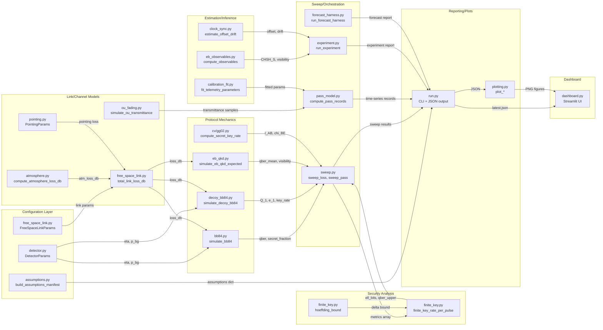
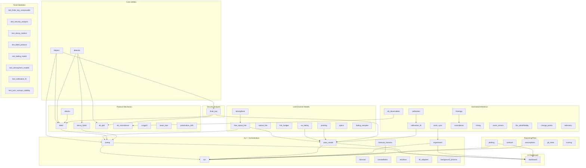

# sat-qkd-security-curves — Architecture & Dependency Contract

**Version:** 1.0
**Status:** Stable public spec

## Scope

This document defines the architectural structure, module boundaries, and extension safety guidelines for the `sat-qkd-security-curves` repository.

**What this repo models:**
- BB84, decoy-state BB84, and E91 (entanglement-based) QKD protocols
- Satellite-to-ground free-space optical link budgets
- Finite-key composable security analysis
- Atmospheric fading, pointing jitter, and background noise effects
- CV-QKD (GG02) structural scaffold (not yet validated)

**What this repo does NOT claim:**
- Production-grade security proofs
- Validated optical link budgets for mission planning
- Meteorological forecasts or real-time atmospheric sensing
- Composable security certificates for deployment

---

## 1. System Overview

### Purpose

This repository is a reproducible "security curve" laboratory that translates link conditions (loss, background noise, detector effects, timing, and attack models) into security viability metrics. It makes the QKD security cliff explicit and measurable, converting physics-level behavior into engineering-facing thresholds before silent failure occurs in the field.

### The Two Worlds

**Simulation World (assumptions → curves):**
Configuration parameters and channel models flow through protocol simulators to produce security curves. Inputs are assumptions (loss profiles, detector parameters, attack models); outputs are QBER, secret fraction, and key rate metrics. This world answers: "Given these assumptions, what is the security margin?"

**Experiment/Telemetry World (observables → decisions):**
Pass-time observables (coincidence rates, timing data, calibration measurements) are ingested, parameters are estimated, and finite-key security decisions are made post-pass. This world answers: "Given these measurements, can we extract a secure key?"

---

## 2. Dataflow Diagrams

### 2.1 High-Level Pipeline (Research Mental Model)

### 2.2 Module Dependency View (Developer Mental Model)

---

## 3. Module Boundary Table

| Boundary | Module(s) | Responsibilities | Inputs | Outputs | Stability | Safe to Override? |
|----------|-----------|------------------|--------|---------|-----------|-------------------|
| **Link/Channel** | `free_space_link.py`, `optical_link.py`, `link_budget.py` | Elevation-to-loss mapping, beam propagation, atmospheric extinction | Elevation (deg), link params | loss_db (float) | Stable | Yes (see §5.1) |
| **Atmosphere** | `atmosphere.py`, `ou_fading.py`, `fading_samples.py` | Fading, turbulence, scintillation | sigma_ln, visibility_km | transmittance samples | Semi-stable | Yes (scenario generator) |
| **Pointing** | `pointing.py`, `optics.py` | Pointing jitter, optical coupling | sigma_point_rad | pointing loss (dB) | Semi-stable | Yes |
| **Protocol BB84** | `bb84.py` | Single-photon BB84 Monte Carlo | n_pulses, loss_db, flip_prob | qber, secret_fraction | Stable | No (core security) |
| **Protocol Decoy** | `decoy_bb84.py` | Decoy-state parameter estimation | DecoyParams, loss_db | Q_1, e_1, key_rate | Stable | No (core security) |
| **Protocol EB** | `eb_qkd.py`, `eb_observables.py`, `eb_coincidence.py` | Entanglement-based QKD | n_pairs, loss_db | qber, visibility, CHSH_S | Stable | No (core security) |
| **Protocol CV** | `cv/gg02.py` | CV-QKD (GG02) scaffold | GG02Params | I_AB, chi_BE (stub) | Experimental | Yes (scaffold only) |
| **Security** | `finite_key.py` | Hoeffding bounds, composable security | n_sifted, n_errors, eps | ell_bits, qber_upper | Stable | No (core security) |
| **Attacks** | `attacks.py` | Attack models (PNS, blinding, etc.) | AttackConfig | modified detection state | Semi-stable | Yes (for red-teaming) |
| **Estimation** | `calibration.py`, `calibration_fit.py`, `fim_identifiability.py` | Parameter fitting, uncertainty | telemetry data | fitted params, R² | Semi-stable | Yes |
| **Timing** | `clock_sync.py`, `timetags.py`, `timing.py`, `coincidence.py` | Sync estimation, coincidence matching | timetag arrays | offset_s, drift_ppm | Semi-stable | Yes |
| **Orchestration** | `run.py`, `sweep.py`, `pass_model.py` | CLI dispatch, loss sweeps, pass simulation | CLI args | JSON reports, figures | Stable | No (public interface) |
| **Experiment** | `experiment.py`, `forecast_harness.py` | A/B harness, forecast scoring | ExperimentParams | blinded reports | Semi-stable | Yes |
| **Reporting** | `plotting.py`, `contract.py`, `assumptions.py` | Figures, JSON validation, manifest | sweep results | PNG, JSON | Stable | Yes (cosmetic) |
| **Dashboard** | `dashboard.py` | Streamlit UI | JSON reports | interactive views | Semi-stable | Yes |
| **Tests** | `tests/test_*.py` | Regression, property-based testing | — | pass/fail | Stable | Yes (add tests) |

---

## 4. Public Contracts (Inputs/Outputs)

### 4.1 CLI Interface Surface

Entry point: `./py -m sat_qkd_lab.run <command>`

**Commands:**
- `sweep` — Loss sweep with CI and attack comparison
- `decoy-sweep` — Decoy-state BB84 sweep
- `pass-sweep` — Satellite pass simulation
- `attack-sweep` — Attack model comparison
- `experiment-run` — Blinded A/B experiment harness
- `forecast-run` — Forecast scoring harness
- `calibration-fit` — Fit detector/link parameters
- `constellation-sweep` — Multi-pass scheduling
- `coincidence-sim` — Coincidence/CAR simulation
- `replay` — Replay prior sweep without drift
- `assumptions` — Print assumptions manifest
- `mission` — Mission narrative simulation
- `clock-sync` — Clock offset/drift estimation
- `sync-estimate` — Sync parameter estimation
- `fading-ou` — OU fading simulator
- `basis-bias` — Basis bias simulator
- `cv-sweep` — CV-QKD (GG02) sweep

### 4.2 Output Artifacts

| Artifact | Location | Semantics |
|----------|----------|-----------|
| `reports/latest.json` | Main sweep output | schema_version, loss_sweep_ci, parameters, assumptions_manifest |
| `reports/latest_pass.json` | Pass sweep output | pass_sweep.records, pass_sweep.summary |
| `reports/latest_experiment.json` | Experiment harness | blinded blocks, metrics |
| `reports/latest_coincidence.json` | Coincidence results | CAR, visibility, sync info |
| `reports/schedule_blinded.json` | Constellation schedule | blinded pass schedule |
| `figures/*.png` | Generated plots | key_qber_vs_loss, finite_key_*, pass_* |

### 4.3 Assumptions Manifest

The assumptions manifest is the **source of truth** for simulation semantics. It is:
- Built by `assumptions.py:build_assumptions_manifest()`
- Embedded in `reports/latest.json` as `assumptions_manifest`
- Printed by `./py -m sat_qkd_lab.run assumptions`

The manifest documents:
- Protocol assumptions (BB84 mode, sifting factor)
- Channel model semantics (loss_db, flip_prob, p_bg, eta)
- Attack model support
- Key rate semantics (asymptotic vs finite-key)
- CV-QKD scaffold status and disclaimers
- Atmosphere scenario generator disclaimers

---

## 5. Extension Points

### 5.1 Add a New Channel Loss/Noise Model

**What to override:** Create a new module or function that computes `loss_db` from physical parameters. Wire it into `pass_model.py` or `sweep.py` via the link params interface.

**What NOT to override:** Do not modify `bb84.py`, `finite_key.py`, or the core security math. Your new model should produce `loss_db` values that flow unchanged into existing protocol logic.

**Required invariants:**
- `loss_db >= 0` (dB is always positive)
- Transmittance `T = 10^(-loss_db/10)` remains in `[0, 1]`

**Recommended tests:** Run `test_optical_link_integration.py`, `test_fading_model.py` after changes.

### 5.2 Swap/Extend Fading or Pointing Jitter Model

**What to override:** `ou_fading.py`, `pointing.py`, or `fading_samples.py`. These produce multiplicative transmittance factors or additive loss contributions.

**What NOT to override:** The way fading factors are applied in `pass_model.py` (multiplicative on transmittance).

**Required invariants:**
- Fading factors must be non-negative
- Mean fading factor should be ~1.0 (or document the bias)

**Recommended tests:** Run `test_ou_fading.py`, `test_pointing_dynamics.py`, `test_fading_samples.py`.

### 5.3 Add/Alter Protocol Mechanics

**What to override:** For new protocols, create a new module (like `cv/gg02.py`). For variants of existing protocols, consider parameterization before forking.

**What NOT to override:** The sifting factor (1/2 for BB84), the binary entropy function, or the secret fraction formula unless you understand the security implications.

**Required invariants:**
- QBER must be in `[0, 0.5]`
- Secret fraction must be in `[0, 1]`
- Key rate per pulse must be non-negative

**Recommended tests:** Run `test_bb84_protocol.py`, `test_decoy_realism.py`, `test_security_analysis.py`.

### 5.4 Change Finite-Key / Composable Security Parameters

**What to override:** `FiniteKeyParams` defaults (eps_pe, eps_sec, eps_cor, ec_efficiency). These can be set via CLI flags.

**What NOT to override:** The Hoeffding bound implementation, the epsilon budget addition formula, or the key length calculation in `finite_key.py`.

**Required invariants:**
- All epsilon values must be in `(0, 1)`
- `ec_efficiency >= 1.0`
- `eps_total = eps_pe + eps_sec + eps_cor`

**Recommended tests:** Run `test_finite_key_composable.py`, `test_finite_key_consistency.py`, `test_finite_key_boundary.py`.

### 5.5 Add New Observables or Telemetry Estimators

**What to override:** Add to `eb_observables.py`, `calibration_fit.py`, or create a new estimation module.

**What NOT to override:** The flow of observables into security decisions. New estimators should output parameters that feed existing security logic.

**Required invariants:**
- Uncertainty estimates must be provided alongside point estimates
- NaN handling must be explicit

**Recommended tests:** Run `test_eb_observables.py`, `test_calibration_fit.py`, `test_fim_identifiability.py`.

### 5.6 Add New Plots/Reports Without Touching Core Math

**What to override:** Add new functions to `plotting.py`. Wire them into `run.py` for CLI access.

**What NOT to override:** Existing plot function signatures (for backward compatibility).

**Required invariants:**
- Plots must use data from the same JSON schema
- Axis labels must include units

**Recommended tests:** Run `test_plotting_scale_settings.py`, `test_figures_exist.py`.

### 5.7 Extend Streamlit Dashboard with New Views

**What to override:** Add panels or tabs in `dashboard.py`.

**What NOT to override:** The blinding logic for experiment views.

**Required invariants:**
- Respect `--unblind` flag semantics
- Use existing JSON report paths

**Recommended tests:** Run `test_dashboard_helpers.py`.

---

## 6. Override Safety Notes

### 6.1 Red Zones (edits likely to silently invalidate security)

- **`finite_key.py:hoeffding_bound()`** — Changing the concentration inequality invalidates all finite-key claims
- **`finite_key.py:finite_key_secret_length()`** — The key length formula is the security proof output
- **`bb84.py:simulate_bb84()` sifting logic** — Incorrect sifting breaks the QBER/key-rate relationship
- **`decoy_bb84.py` single-photon bounds** — These are the PNS-attack defense
- **Epsilon budget arithmetic** — `eps_total = eps_pe + eps_sec + eps_cor` is exact, not approximate
- **Binary entropy `h2()` implementation** — Numerical stability matters for edge cases

### 6.2 Yellow Zones (requires targeted tests / careful review)

- **Detector model parameters** — Changing `eta`, `p_bg`, afterpulsing affects QBER calculation
- **Attack implementations** — New attacks should increase QBER, not decrease it
- **Calibration fitting** — Poor fits can produce unrealistic parameter estimates
- **Clock sync estimation** — Timing errors can inflate apparent QBER
- **Background process models** — Day/night factor affects signal-to-noise

### 6.3 Green Zones (safe swaps that preserve security semantics)

- **Link budget geometry** — Elevation-to-loss mapping (as long as loss_db stays valid)
- **Atmospheric scenario models** — These are scenario generators, not security claims
- **Plotting cosmetics** — Colors, labels, figure sizes
- **CLI flag names** — As long as semantics are preserved
- **Dashboard layout** — UI arrangement changes
- **New test files** — Adding tests is always safe

### 6.4 Failure Archetypes

**"Security looks better but for the wrong reason"**

Example: A sifting bug that undercounts errors makes QBER appear lower than reality. The curves look great, but the key is not actually secure.

*Detection:* Cross-check QBER against independent Monte Carlo runs. Verify that `n_errors / n_sifted ≈ qber` within statistical bounds.

**"Curves shift due to UI/config drift rather than physics"**

Example: A CLI default changes from `--pulses 200000` to `--pulses 20000`. Finite-key penalties increase dramatically, but the physics hasn't changed.

*Detection:* The `assumptions_manifest` should capture all defaults. Compare manifests across runs. Test `test_json_contract_stability.py` should catch schema drift.

---

## 7. Validation Mapping

### Tests Protecting Link Model
- `test_optical_link_integration.py`
- `test_fading_model.py`
- `test_atmosphere_models.py`
- `test_pointing_dynamics.py`
- `test_ou_fading.py`
- `test_fading_samples.py`

### Tests Protecting Finite-Key / Composable Logic
- `test_finite_key_composable.py`
- `test_finite_key_consistency.py`
- `test_finite_key_boundary.py`
- `test_security_analysis.py`

### Tests Protecting Decoy Realism / Estimator Constraints
- `test_decoy_realism.py`
- `test_detector_effects.py`
- `test_detector_attacks.py`

### Tests Protecting Protocol Mechanics
- `test_bb84_protocol.py`
- `test_eb_observables.py`
- `test_eb_pass_experiment.py`
- `test_bell_visibility_matrix.py`
- `test_cv_scaffold.py`

### Tests Protecting Calibration/Estimation
- `test_calibration.py`
- `test_calibration_fit.py`
- `test_calibration_model_card.py`
- `test_calibration_residual_diagnostics.py`
- `test_fim_identifiability.py`

### Tests Protecting Timing/Sync
- `test_clock_sync.py`
- `test_timing_sync_layer.py`
- `test_timetag_coincidence.py`
- `test_sync_leakage_firewall.py`
- `test_sync_estimate_command.py`

### Tests Protecting UI/Reporting
- `test_dashboard_helpers.py`
- `test_plotting_scale_settings.py`
- `test_plotting_headroom_and_sweep_engineering.py`
- `test_figures_exist.py`
- `test_json_contract_stability.py`

### Tests Protecting Contracts
- `test_contract_validator.py`
- `test_engineering_outputs.py`
- `test_assumptions_manifest.py`

### Coverage Gaps (noted, not implemented here)
- CV-QKD (GG02) Holevo bound validation — scaffold only
- Multi-protocol interoperability testing
- Hardware-in-the-loop regression suite

---

## 8. Glossary

| Term | Definition |
|------|------------|
| **QBER** | Quantum Bit Error Rate — fraction of sifted bits where Alice and Bob disagree |
| **Sifted key rate** | Bits per pulse after basis reconciliation (BB84: ~1/2 of received) |
| **Secret fraction** | Fraction of sifted bits extractable as secure key after privacy amplification |
| **Finite-key penalty** | Reduction in extractable key due to statistical uncertainty in small samples |
| **Decoy yields** | Observed detection rates at different intensity levels for PNS bound estimation |
| **CHSH S-parameter** | Bell inequality witness; |S| > 2 indicates entanglement |
| **Visibility** | Fringe visibility in Bell/coincidence measurements; relates to entanglement quality |
| **CAR** | Coincidence-to-Accidental Ratio — signal quality metric for heralded sources |
| **Transmittance (η, T)** | Probability a photon survives the channel; T = 10^(-loss_db/10) |
| **eps_pe, eps_sec, eps_cor** | Security failure probabilities for parameter estimation, secrecy, and correctness |
| **h2(x)** | Binary entropy function: -x log₂(x) - (1-x) log₂(1-x) |

---

## 9. Changelog

| Version | Date | Changes |
|---------|------|---------|
| 1.0 | 2026-01-05 | Initial architecture contract |
